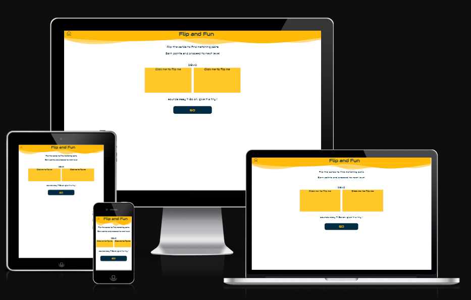

[Live Webpage](https://ysgurjar.github.io/pp2-flip-card-game/)

## Table of Content

1. [Business Objective - Strategy Plane](#stretegy-plane)
    1. [The business objective](#business-objective)
    2. [The potential user](#the-potential-user)
    3. [The user requirements](#the-user-requirements)
    4. [Task](#task)
2. [The Scope Plane](#the-scope-plane)
    1. [The feature requirements](#the-feature-requirements)
    2. [The content requirements](#the-content-requirements)
    3. [The feasibility study](#the-feasibility-study)
    4. [The user stories](#the-user-stories)
3. [The Structure and Skeleton Plane](#the-structure-plane)
    1. [Game logic](#game-logic)
    2. [Wireframe](#wireframe)
4. [Deployment](#deployment) 
5. [Testing](#testing)
    1. [Code validation](#code-validation)
    2. [Performance](#performance)
    3. [Interactivity](#interactivity)
    4. [User story testing with implemented features](#user-story-testing)
    5. [Browser compatibility](#browswer-compatibility)
    6. [Responsiveness](#responsiveness)
    7. [Bugs](#bugs)
6. [Future work](#future-work)
   
7. [References](#references)

# Stretegy Plane

## Business Objective

To build a memory-pair game which is interactive in nature, easy to navigate and fun to play. Through this game the site owner will gain traction in website traffic and the user will have fun while training for memory.

### The potential user

Anyone looking ad free online game that will improve the memory and provide an element of joy and excitement. Most probable users are kids from six to fifteen year old. An elderly person can also play with an intent to improve memory retention.

### The user requirements

The user ultimately wants to be challenged and upon completion of challenge needs to be delighted. The user should be able to know the rules, be able to play according to the rules and get results at the end. The user should be able to play against computer at will. Based on the results, he will have an option to share the results among friends, try again or abort. The user might have some exciting ideas or encountered bugs that he would like to share with website owner and the website should provide an interface to do so. The user should be able to share the link on social media at will. The user should be able to see his position on the leaderboard.

### Task
Conduct research to understand UI of the similar games available on the internet. The user should feel somewhat familiar with our product, but with an element of surprise. 

# The Scope Plane

### The feature requirements
1. Logo
2. Rules page
3. Challenge page which leads to multiple challenges.
4. Ability to share the website link to social media
5. Contact us page
6. Leaderboard page
7. Coming soon page
8. Ability to play against the computer or bot
9. Positive feedback through words, image or animation upon successful completion of challenge.
10. Encouraging words, image or animation upon unsuccessful attempt.
11. Prompt to share results or game on social media.

### The content requirements
The user will be presented with five progressively difficult levels. Each level will challenge speed and/or accuracy to remember. Upon completion of the challenge, the user will have three options. If he fails the challenge he can try again. If he passes the challenge, he can progress to the next challenge with an option to share the result of the current challenge to social media.

### The feasibility study

Sum of importance : 31

Sum of feasibility: 23

Based on the study, the following features were selected for the first release.

## The user stories

1. As a first-time user, I want to know what the game is about so that I can decide whether to proceed further or not.
2. As a first-time or returning user, I want to select the level of difficulty so that I can play the game.
3. As a player, I want to know the rules before the challenge begins.
4. As a player, after reading the rules I want to decide whether to proceed with the current level or abort.
5. As a player, I want to see a clear overview of how far I am in the game, so I can adjust my strategy to win.
6. As a player, I want to be able to abort the game anytime I want.
7. As a player, after losing the game I should have an option to retry.
8. As a player, after winning the game I want to have an option to share my results with others.
9. As a player, after winning the game I want to go to the next level.
10. As a player, after I have passed the maximum difficultly level, I want to know what is coming soon.
11. As a player, if I have new ideas or encountered bugs I should be able to share them with the website owner.

[def]: docs/feasibility-matrix.png

# The Structure and Skeleton Plane

### Game logic

The following [image](docs/user-navigation-logic.png) gives an overview of user navigation on the site.

The following [image](docs/card-game-logic.png) explains the core logic of the game.

### Wireframe

Mobile first approach was selected because of expected user traffic on mobile platform. The approach is to create wireframe for mobile and then write media queries to accomodate the desktop version.

[Wireframe and mock up](docs/wireframe.png) are created in figma. As you can see, a simple two tone color design was selected. 

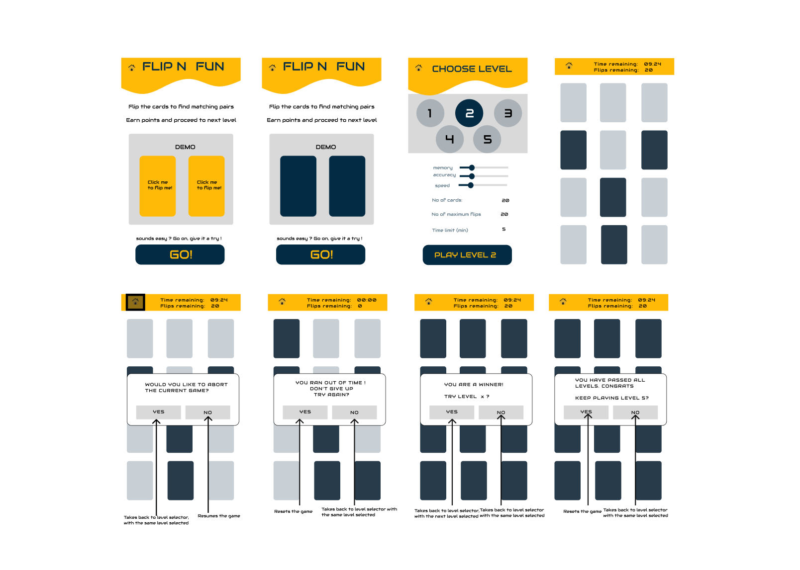 

# Deployment

The website was deployed using GitHub Pages by following these steps:
1. In the GitHub repository navigate to the Settings tab
2. On the left hand menu select Pages
3. For the source select Branch: master
4. After the webpage refreshes automaticaly you will se a ribbon on the top saying: "Your site is published at https://ysgurjar.github.io/pp2-flip-card-game/"

You can for fork the repository by following these steps:
1. Go to the GitHub repository
2. Click on Fork button in upper right hand corner

You can clone the repository by following these steps:
1. Go to the GitHub repository 
2. Locate the Code button above the list of files and click it 
3. Select if you prefere to clone using HTTPS, SSH, or Github CLI and click the copy button to copy the URL to your clipboard
4. Open Git Bash
5. Change the current working directory to the one where you want the cloned directory
6. Type git clone and paste the URL from the clipboard ($ git clone https://github.com/YOUR-USERNAME/YOUR-REPOSITORY)
7. Press Enter to create your local clone.

# Testing

## Code validation
- All HTML pages were tested on [W3C validator]("https://validator.w3.org/#validate_by_input") --> No errors

    - index.html [results](https://validator.w3.org/nu/?doc=https%3A%2F%2Fysgurjar.github.io%2Fpp2-flip-card-game%2F)

    - levels.html [results](https://validator.w3.org/nu/?doc=https%3A%2F%2Fysgurjar.github.io%2Fpp2-flip-card-game%2Flevels.html) 

    - game.html [results](https://validator.w3.org/nu/?doc=https%3A%2F%2Fysgurjar.github.io%2Fpp2-flip-card-game%2Fgame.html) 

- All CSS pages were tested on [Jigsaw validator]("https://jigsaw.w3.org/css-validator/#validate_by_input") via direct input--> No errors

- All JS pages were tested on [jshint]("https://jshint.com/") via direct input--> No errors found

- The site was tested for accessibility and contrast errors on [wave](!https://wave.webaim.org/) --> No common errors or contrast errors
    - index.html [results](https://wave.webaim.org/report#/https://ysgurjar.github.io/pp2-flip-card-game/index.html)
    - levels.html [results](https://wave.webaim.org/report#/https://ysgurjar.github.io/pp2-flip-card-game/levels.html)
    - game.html [results](https://wave.webaim.org/report#/https://ysgurjar.github.io/pp2-flip-card-game/game.html)
    
- No critical warning are present in all cases

## Performance

The lighthouse score is greater than 90 for all criteria and all webpages.

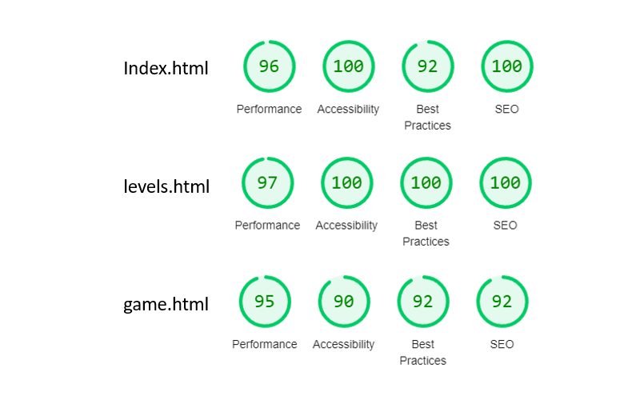

## Interactivity

The interactivity on home page

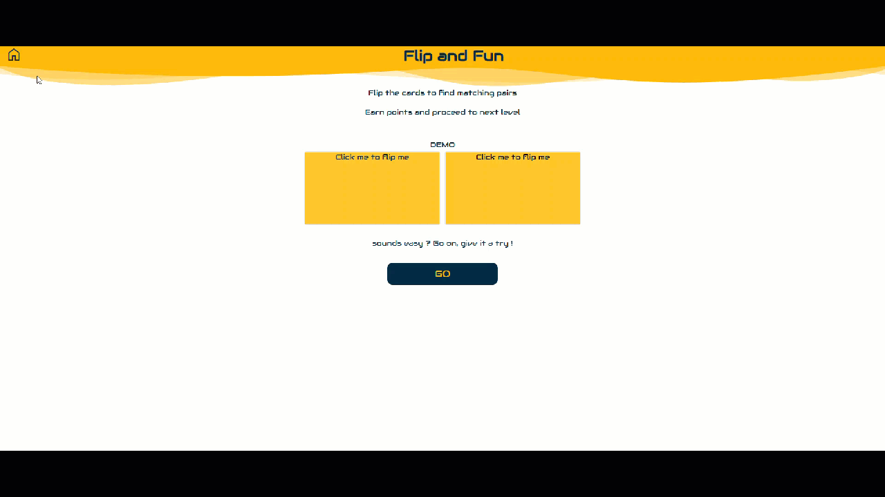

 The interactivity on level selector page

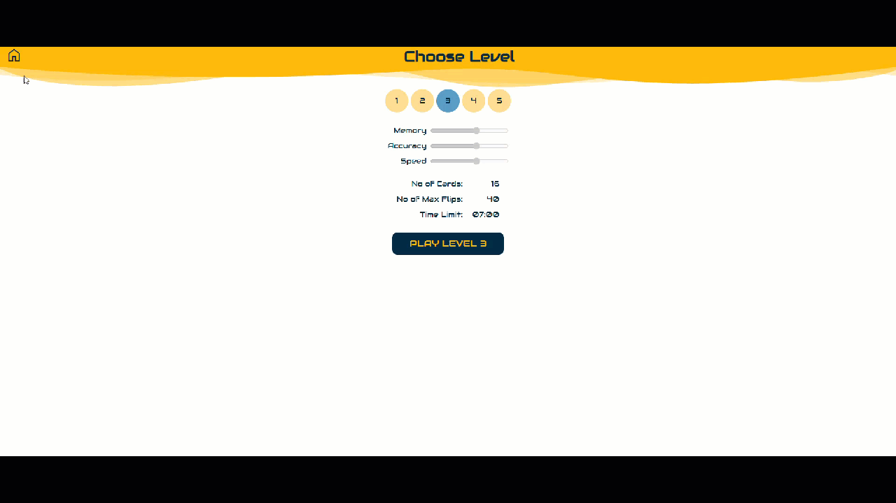

The interactivity on game page

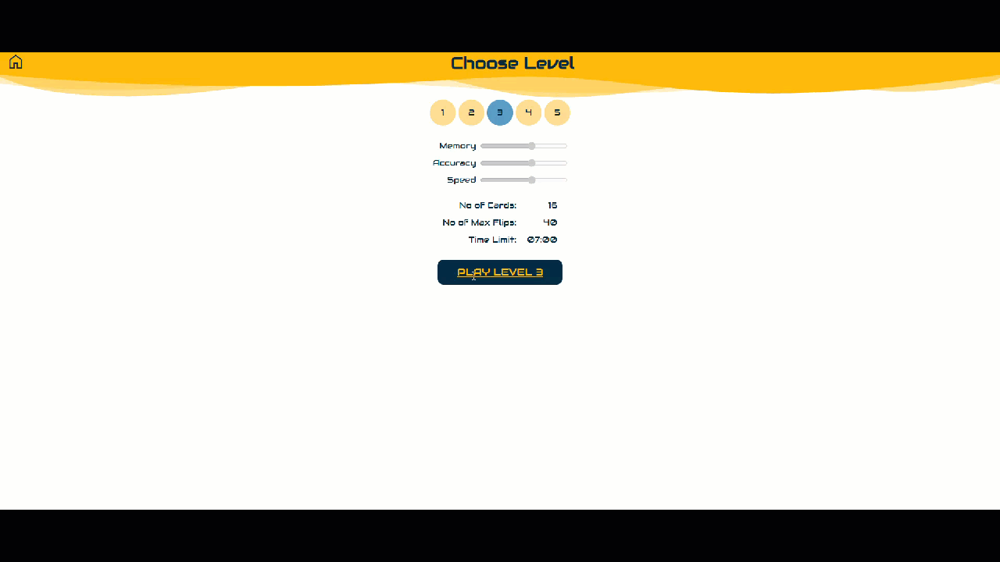

## User story testing and feature implementation
1. As a first-time user, I want to know what the game is about so that I can decide whether to proceed further or not.
    
    **Feature Implementation**: Display rules on the home page

    

Screenshot

    
    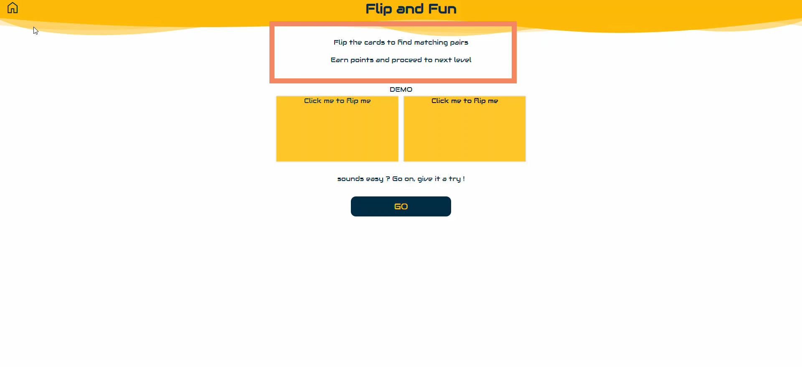
    

2. As a first-time or returning user, I want to select the level of difficulty so that I can play the game.
    
     **Feature Implementation**: Make a level selector page

    

Screenshot

    
    

3. As a player, I want to know the rules before the challenge begins.

     **Feature Implementation**: Display rules on the level page

    

Screenshot

    
    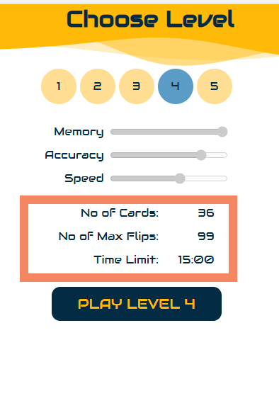
    

4. As a player, after reading the rules I want to decide whether to proceed with the current level or abort.

     **Feature Implementation**: Let the user initiate an action by clicking on PLAY btn

    

Screenshot

    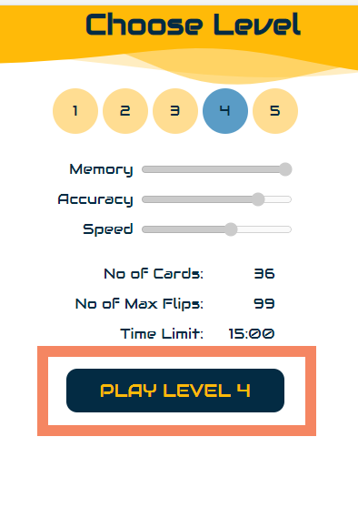
    

5. As a player, I want to see a clear overview of how far I am in the game, so I can adjust my strategy to win.

     **Feature Implementation**: Display the time and flips remaining on top of the page

    

Screenshot

    
    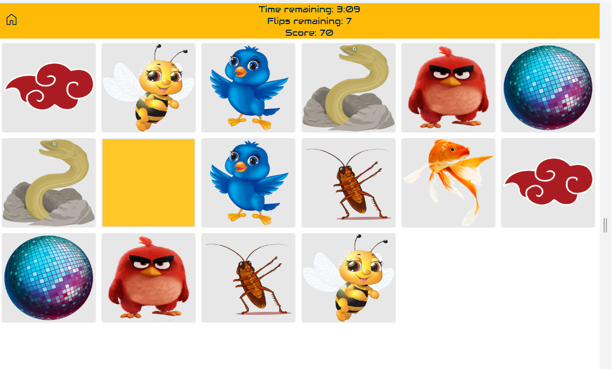
    

6. As a player, I want to be able to abort the game anytime I want.

     **Feature Implementation**: Enable the home button to take back to levels if user wishes to abort in the middle of the game

    

Screenshot

    
    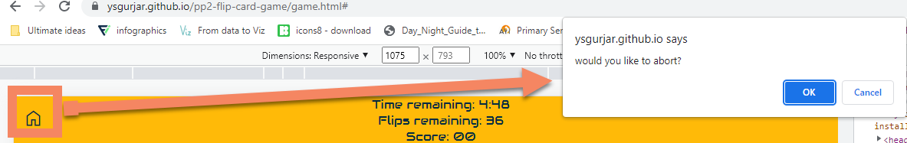
    

7. As a player, after losing the game I should have an option to retry.

     **Feature Implementation**: Prompt the user to retry when he runs out of time or flips. When confirmed, reload the game with new random assignment of cards

    

Screenshot

    
    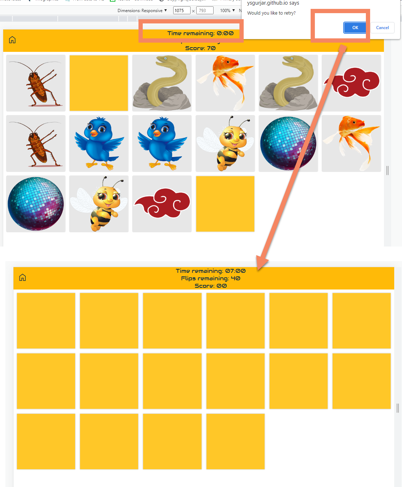
    

8. As a player, after winning the game I want to have an option to share my results with others.

     **Feature Implementation**: Pending, to be covered in the next sprint
    
9. As a player, after winning the game I want to go to the next level.

     **Feature Implementation**: Select next level automatically when the user succeeds and take him back to levels page so he can read the rules for the selected level.

    

Screenshot

    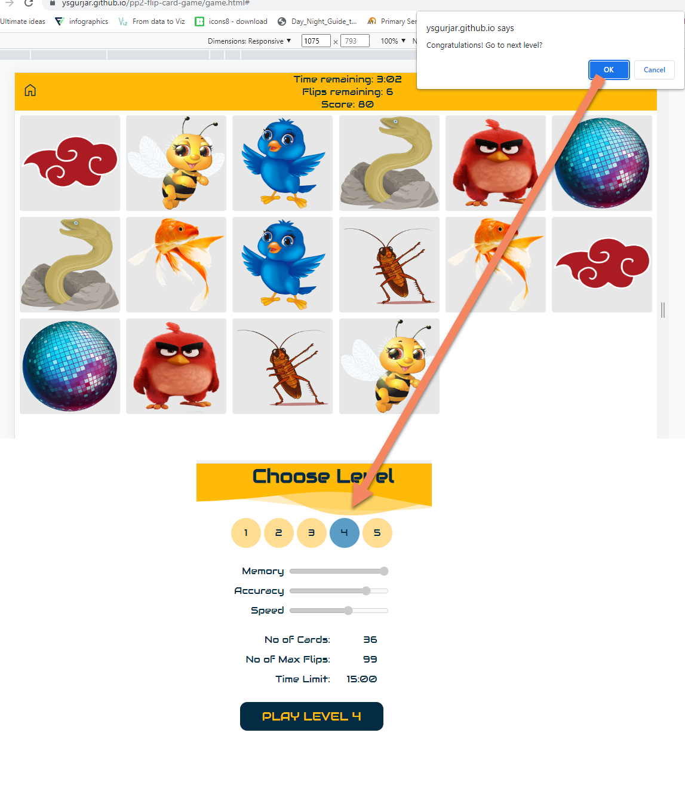
    

10. As a player, after I have passed the maximum difficultly level, I want to know what is coming soon.

     **Feature Implementation**: Pending, to be covered in the next sprint

11. As a player, if I have new ideas or encountered bugs I should be able to share them with the website owner.

     **Feature Implementation**: Pending, to be covered in the next sprint

## Browswer compatibility

No broswer related bugs were found.

## Responsiveness

The site is fully responsive upto minimum screen width of 320 px, which corresponds to iphone 5. For desktop version, the grid layout expands maximum upto 1420 px.

Full screen width view

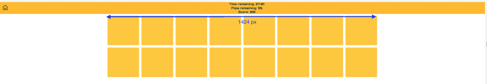
    

iPhone 5 view

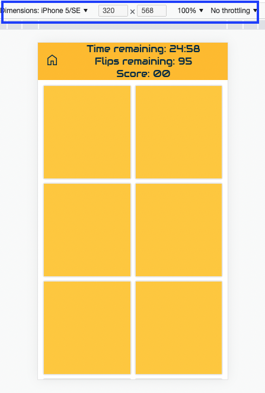
    

## Bugs

| **Bug** | **Fix** |
| ----------- | ----------- |
| The slider element is interactive thus giving the user the idea of manipulating it | Grey out and disable the slider element |
| The grid layout does not appear as cards, appears as just horizontal lines | Use **autofit** with **mixmax** while forcing min height of a card |
| Images are not assigned to a pair of cards, leading to one unpaired card | In the same for-loop assign a single image to two cards before moving to the next image assignment |
| All cards are flipped back instead of the last two un-matched cards | Implement a flip counter and reset it to zero after checking conditions |
| The user can flip back the matched cards | disable click on revealed cards |
| The user can keep clicking on other cards while un-matched cards are waiting to be flipped back | During the waiting period, disable the click event on all cards |
| After the user completes level 5, he is redirected to level 6 on the level selector page, which does not exist| Add logic to the level selector page to prevent overflow |
| When the levels page is loaded the first time, no levels are selected and clicking on the play button leads to an error | Make sure at least one level stay selected all the time no matter if the page is revisited or visited the first time. |

# Future Work

- Instead of an alert, implement dialog or modal for better user experience
- Implement features related to pending user stories which is 8,10,11 which correspond to opportunities F,G and D as described under [Feasibility matrix](docs/feasibility-matrix.png)

# References

The flip card CSS effect is from [Jefferson Cuarta](https://jefferson-cuartas.medium.com/how-to-create-a-flip-card-effect-using-javascript-767dd945210c).

The timer function is from the following [Codepen](https://codepen.io/ishanbakshi/pen/pgzNMv) created by Shashan Bakshi.

All the images are taken from [pngwing](https://www.pngwing.com/) website and contains images distributed under Non-commercial use, DMCA licence and do not require individual credit.

### Special thanks to my mentor M.Shami for support and guidance.
 