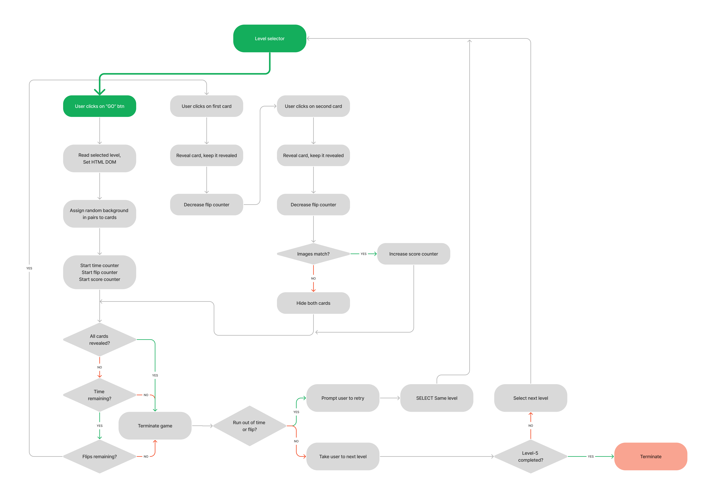

[Live Webpage](https://ysgurjar.github.io/pp2-flip-card-game/)

## Table of Content

1. [Business Objective - Strategy Plane](#stretegy-plane)
    1. [The business objective](#business-objective)
    2. [The potential user](#the-potential-user)
    3. [The user requirements](#the-user-requirements)
    4. [Task](#task)
2. [The Scope Plane](#the-scope-plane)
    1. [The feature requirements](#the-feature-requirements)
    2. [The content requirements](#the-content-requirements)
    3. [The feasibility study](#the-feasibility-study)
    4. [The user stories](#the-user-stories)

# Stretegy Plane

## Business Objective

To build a memory-pair game which is interactive in nature, easy to navigate and fun to play. Through this game the site owner will gain traction in website traffic and the user will have fun while training for memory.

### The potential user

Anyone looking ad free online game that will improve the memory and provide an element of joy and excitement. Most probable users are kids from six to fifteen year old. An elderly person can also play with an intent to improve memory retention.

### The user requirements

The user ultimately wants to be challenged and upon completion of challenge needs to be delighted. The user should be able to know the rules, be able to play according to the rules and get results at the end. The user should be able to play against computer at will. Based on the results, he will have an option to share the results among friends, try again or abort. The user might have some exciting ideas or encountered bugs that he would like to share with website owner and the website should provide an interface to do so. The user should be able to share the link on social media at will. The user should be able to see his position on the leaderboard.

### Task
Conduct research to understand UI of the similar games available on the internet. The user should feel somewhat familiar with our product, but with an element of surprise. 

# The Scope Plane

### The feature requirements
1. Logo
2. Rules page
3. Challenge page which leads to multiple challenges.
4. Ability to share the website link to social media
5. Contact us page
6. Leaderboard page
7. Coming soon page
8. Ability to play against the computer or bot
9. Positive feedback through words, image or animation upon successful completion of challenge.
10. Encouraging words, image or animation upon unsuccessful attempt.
11. Prompt to share results or game on social media.

### The content requirements
The user will be presented with five progressively difficult levels. Each level will challenge speed and/or accuracy to remember. Upon completion of the challenge, the user will have three options. If he fails the challenge he can try again. If he passes the challenge, he can progress to the next challenge with an option to share the result of the current challenge to social media.

### The feasibility study

Sum of importance : 31

Sum of feasibility: 23

Based on the study, the following features were selected for the first release.

### The user stories

[def]: docs/feasibility-matrix.png

# The Structure Plane

### Game logic

The following [image](docs/user-navigation-logic.png) gives an overview of user navigation on the site.

The following [image](docs/card-game-logic.png) explains the core logic of the game.

### Wireframe